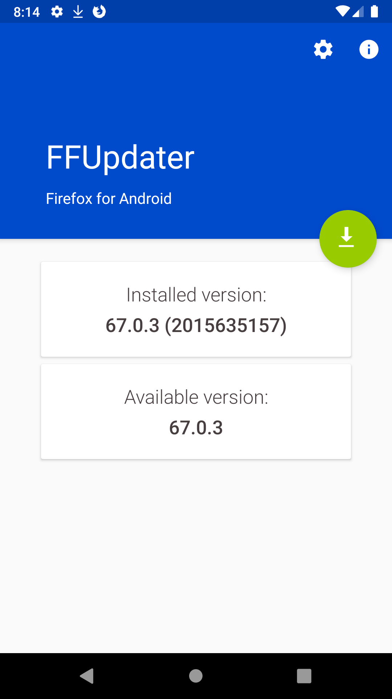
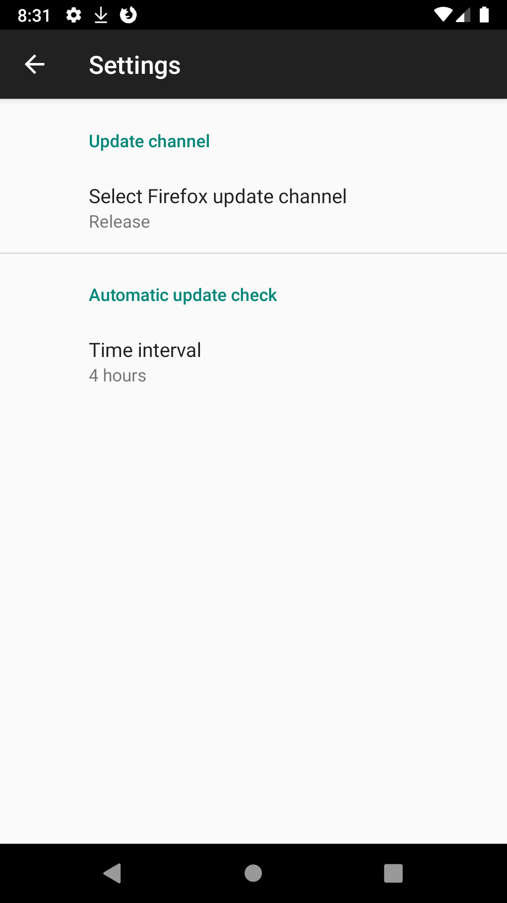

[](https://f-droid.org/app/de.marmaro.krt.ffupdater)

## Firefox-Updater

An Android app to install and update Firefox (and Beta/Nightly) for Android on your device, without using the Google Play Store.

Periodical the app will check for updates and will display a notification when a new update is available. The time interval of the automatic update checks can be configured.

## Screenshots





## Technical detail

Internally the [Mozilla API](https://archive.mozilla.org/pub/mobile/releases/) will be queried. 

When an update is available, the user will be redirect to `https://download.mozilla.org/?product=[fennec-latest|fennec-beta-latest,fennec-nightly-latest]&os=[android|android-x86]&lang=multi`.
For example `https://download.mozilla.org/?product=fennec-beta-latest&os=android-x86&lang=multi`.


## History

Since Mozilla [shut down their FTP server on 2015-08-05](https://blog.mozilla.org/it/2015/07/27/product-delivery-migration-what-is-changing-when-its-changing-and-the-impacts/), non-playstore updates of Firefox have to be done by third-party apps such as this one.


Mozilla now uses a uniform URL to point to the latest release, see [their README](https://archive.mozilla.org/pub/mobile/releases/latest/README.txt) for details. The current URL for Android is: https://download.mozilla.org/?product=fennec-latest&os=android&lang=multi

I opened a ticket about non-playstore updates with Mozilla in 2015, as did others:

- [ ] https://bugzilla.mozilla.org/show_bug.cgi?id=1192279
- [x] https://bugzilla.mozilla.org/show_bug.cgi?id=1220773

### Maintainer:

#### Tobiwan (now)

#### Boris Kraut (https://gitlab.com/krt/ffupdater, until April 2019)
> Since I left F-Droid (and Android/Smartphones) about a year ago, I am looking for a new maintainer to take over. Unfortunately the upstream issue I opened years ago is still not solved in 2019. While Fennec F-Droid is back in the mainline repo and other binary repos do serve Firefox, some might still prefer this updater. So as I said: Maintainers welcome. The main task should be to test the last few merge requests (especially the background update stuff) and release a new version.
> **New Maintainer: https://notabug.org/Tobiwan/ffupdater**

## License

````
FFUpdater -- a simple Android app to update Firefox.
Copyright (C) 2015-2019 Boris Kraut <krt@nurfuerspam.de>

This program is free software: you can redistribute it and/or modify
it under the terms of the GNU General Public License as published by
the Free Software Foundation, either version 3 of the License, or
(at your option) any later version.

This program is distributed in the hope that it will be useful,
but WITHOUT ANY WARRANTY; without even the implied warranty of
MERCHANTABILITY or FITNESS FOR A PARTICULAR PURPOSE. See the
GNU General Public License for more details.

You should have received a copy of the GNU General Public License
along with this program. If not, see <http://www.gnu.org/licenses/>.
````
